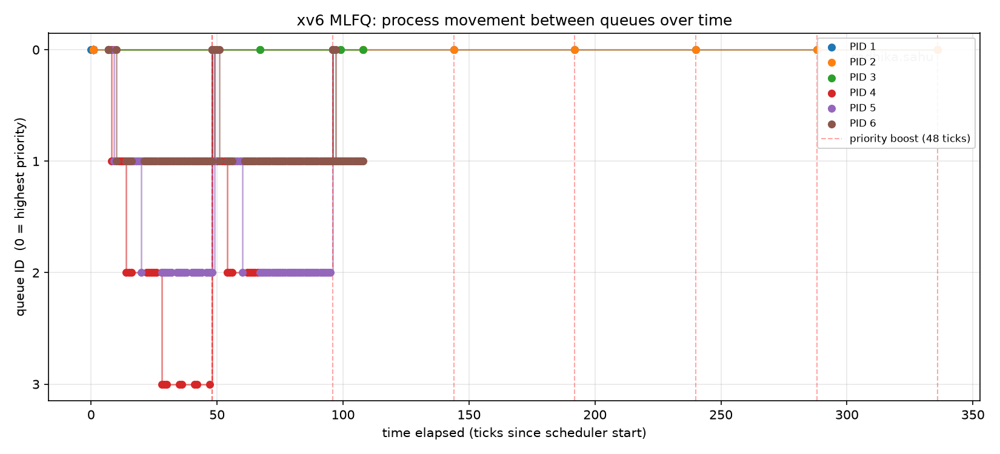
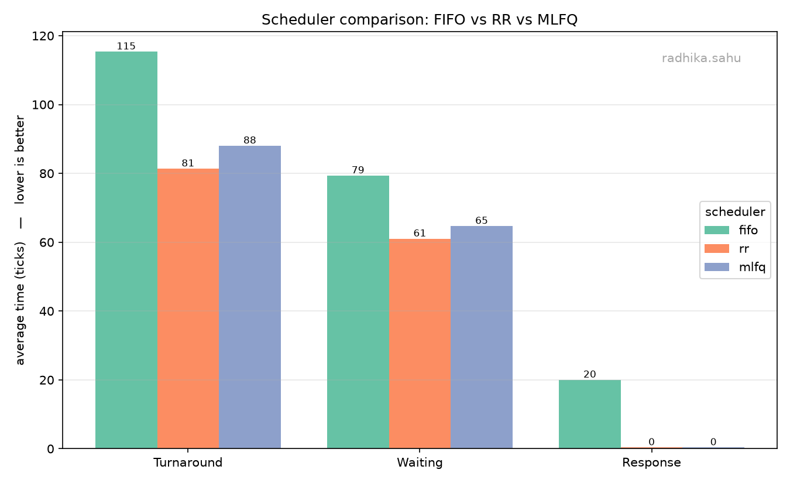

# MLFQ Scheduler Report

## 2.3.1 Implementation Summary

**Makefile / `SCHEDULER` macro -** A compile time switch selects the scheduler: `SCHEDULER=MLFQ`
adds `-D MLFQ`, `SCHEDULER=FIFO` adds `-D FIFO`, and an optional `LOG=1` adds `-D MLFQ_LOG`
(turns on the per-event log used for the timeline plot) while `PERF=1` adds `-D PERF` (turns on
the per-process metric print). With no `SCHEDULER` set, the original round robin path compiles
unchanged.

**`struct proc` changes (`kernel/proc.h`) -** Added `priority` (current queue 0..3),
`ticks_used` (ticks spent in the current slice), `enter_seq` (a monotonic sequence number giving
FIFO order within a queue), and metrics fields `ctime, stime, etime, rtime` (arrival, first run,
exit, and total CPU ticks) used for the cross scheduler comparison.

**`allocproc()` changes -** On creation I record `ctime = ticks`, set `stime = -1` ("not yet run"),
and zero `etime`/`rtime`. For MLFQ the process is placed at the tail of queue 0 (`priority = 0`,
`ticks_used = 0`, fresh `enter_seq`), Rule 1.

**Queue selection / preemption (`scheduler()`) -** The scheduler scans all RUNNABLE processes and
picks the lowest `priority` (highest priority queue); ties break by smallest `enter_seq`, giving
FIFO order inside a queue and round robin in queue 3 (Rules 2 and 6). The first time a process is
picked I set `stime = ticks` for response time.

**Time slice handling (`mlfq_tick_yield()`) -** Each tick increments `ticks_used`; when it reaches
the slice for the current queue (`{1,4,8,16}`) the process is demoted to the tail of the next
lower queue (or stays at the tail of queue 3 if already lowest) and its slice resets, Rule 4.
Mid slice, if a higher priority queue becomes non empty, the process yields so the higher queue
runs first, Rule 2.

**Voluntary yield (sleep/wakeup) -** A sleeping process keeps its `priority`; on wake up it is
re-inserted at the tail of the *same* queue with a fresh `enter_seq`, Rule 5. This is why
I/O, bound processes stay in high priority queues.

**Priority boosting -** `clockintr()` calls `mlfq_boost()` every 48 ticks, moving every process
back to queue 0 with a fresh `enter_seq` (anti-starvation).

**CPU time accounting -** `update_time()` runs on every tick (all schedulers) and increments
`rtime` for the RUNNING process, so waiting time can be computed for FIFO/RR/MLFQ alike.

**`procdump()` changes -** The Ctrl-P dump prints per process: PID, state, name, current queue,
`ticks_used`, `enter_seq`, and `ctime`, so queue movement, preemption, and boosts are verifiable
live.

## 2.3.2 MLFQ Analysis

`user/schedulertest.c` spawns three children with different CPU-burst / yield patterns:
child 0 CPU-bound (one long burst, never yields), child 1 mixed (short bursts + short `pause`),
child 2 I/O-bound (tiny burst + long `pause`). 

**Interpretation -** PID 4 is the CPU bound child: it never yields, exhausts each slice, and sinks
0→1→2→3, bottoming out in queue 3. PID 6 is the I/O bound child: it gives up the CPU after a tiny
burst every time, so by Rule 5 it keeps its priority and rides in the high queues (0–1). PID 5 is
the mixed child, settling around queues 1–2. At tick 48 (the red dashed line) every active process
jumps back to queue 0, the priority boost that rescues the CPU bound PID 4 from starving at the
bottom, after which it sinks again. PID 3 is the `schedulertest` parent, which spends almost all
its time asleep in `wait()`, so it stays at queue 0. This is textbook MLFQ: interactive/short jobs
are favoured while long jobs still make guaranteed progress thanks to the boost.

---

## 2.3.3 Comparison Results

Same workload (`schedulertest`) under all three schedulers, `CPUS=1`, `PERF=1`. Averages over the
three workload children (parent excluded; `plot_compare.py --children-only`). Times in ticks.

| Scheduler | Avg Turnaround | Avg Waiting | Avg Response |
| --------- | -------------- | ----------- | ------------ |
| FIFO      | 115.3          | 79.3        | 20.0         |
| RR        | 81.3           | 61.0        | 0.3          |
| MLFQ      | 88.0           | 64.7        | 0.3          |

Per process: Turnaround = etime − ctime, Response = stime − ctime, Waiting = Turnaround − rtime.

**Discussion -** FIFO runs each job to completion, so later children can't touch the CPU until the
long CPU bound child ahead of them finishes, this is the convoy effect, and it shows up as FIFO's
much larger response time (20.0 vs 0.3 ticks). RR and MLFQ both preempt, so every job reaches the
CPU almost immediately, giving near zero response time. RR slices the CPU in fixed quanta and here
edges out MLFQ slightly on turnaround, because with a mixed workload RR's constant rotation happens
to finish the shorter children a little sooner; RR's waiting time, though, depends heavily on the
quantum, a smaller quantum improves response but adds context switch overhead. MLFQ's demotion
keeps the single CPU hog from dominating the top queue, and its 48 tick boost prevents the
starvation a naive multilevel scheme would cause. Overall FIFO is clearly worst for interactive
responsiveness, while RR and MLFQ are close, with MLFQ offering the better structural guarantees
(no starvation, automatic separation of interactive from CPU bound jobs) at the cost of a little
extra bookkeeping.